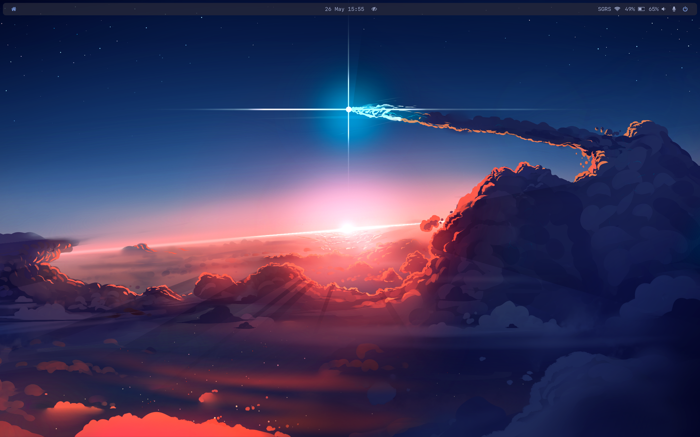
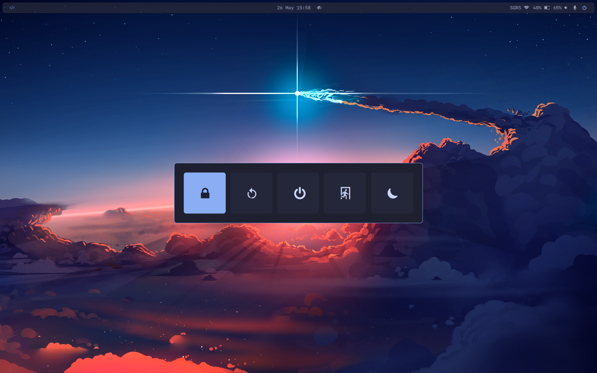
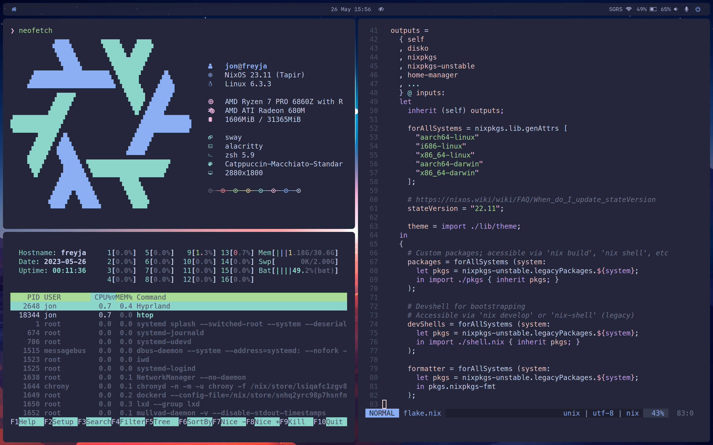

# jnsgruk's nixos config

This repository contains a [Nix Flake](https://nixos.wiki/wiki/Flakes) for configuring my machines.

The machines configured thus far are:

| Hostname |          Model          |   OS   |  Role   | Desktop  |
| :------: | :---------------------: | :----: | :-----: | :------: |
|  `dev`   |     [Multipass] VM      | Ubuntu | Server  |    -     |
| `freyja` |   Lenovo Thinkpad Z13   | NixOS  | Laptop  | Hyprland |
| `hugin`  | Lenovo Thinkcentre M93p | NixOS  | Server  |    -     |
|  `kara`  |   Ryzen 7950X Custom    | NixOS  | Desktop | Hyprland |
|  `loki`  |   Ryzen 3900X Custom    | NixOS  | Server  |    -     |
|  `thor`  |     Intel NUC6i7KYK     | NixOS  | Server  |    -     |

## Structure

- [home]: my home-manager configuration
- [host]: host-specific configurations
- [overlays]: package/configuration overlays
- [pkgs]: my custom package definitions
- [scripts]: helper scripts for machine setup

## Applications / Packages

The following is a list of the key elements of my setup, with links to their config:

| Type  | Details                                                |
| :---: | :----------------------------------------------------- |
| Shell | [zsh], [starship], [nvim], [tmux], [neofetch]          |
|  WM   | [hyprland] [sway], [waybar], [swaylock], [mako], [gtk] |
| Apps  | [vscode], [zathura], [alacritty]                       |

## Screenshots

<!-- Links -->

[Multipass]: https://multipass.run

<!-- Structure -->

[home]: ./home
[host]: ./host
[overlays]: ./overlays
[pkgs]: ./pkgs
[scripts]: ./scripts

<!-- Applications / Packages -->

[alacritty]: ./home/common/desktop/alacritty.nix
[gtk]: ./home/common/desktop/gtk.nix
[hyprland]: ./home/common/desktop/hyprland/default.nix
[mako]: ./home/common/desktop/sway/services.nix
[neofetch]: ./home/common/shell/neofetch.nix
[nvim]: ./home/common/shell/vim.nix
[starship]: ./home/common/shell/starship.nix
[sway]: ./home/common/desktop/sway/default.nix
[swaylock]: ./home/common/desktop/sway/swaylock.nix
[tmux]: ./home/common/shell/tmux.nix
[vscode]: ./home/common/desktop/vscode.nix
[zathura]: ./home/common/desktop/zathura.nix
[waybar]: ./home/common/desktop/sway/waybar/default.nix
[zsh]: ./home/common/shell/zsh.nix
