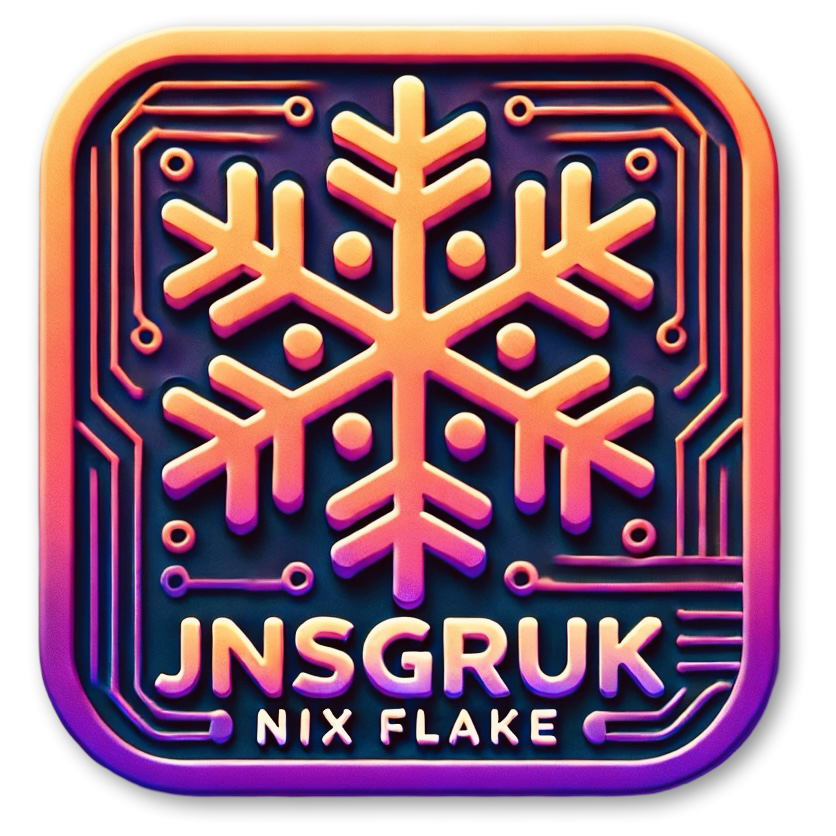

  

<h1 align="center">jnsgruk's <a href="https://nixos.org">NixOS</a> & <a href="https://github.com/nix-community/home-manager">Home Manager</a> Configurations</h1>

This repository contains a [Nix Flake](https://nixos.wiki/wiki/Flakes) for configuring my machines. As a general rule, my "server" machines track the latest stable release of NixOS, and my workstations/laptops track `unstable`.

I use [Hyprland](https://hyprland.org/) as my tiling window manager, [Ghostty](https://ghostty.org/) as my terminal emulator, and I move between [Helix](https://helix-editor.com/) and [Visual Studio Code](https://code.visualstudio.com/) for editing. All of my apps/system components are themed with the excellent [Catppuccin](https://catppuccin.com/) theme where possible. I also rely on [1Password](https://1password.com/), [Obsidian](https://obsidian.md/) and [Todoist](https://todoist.com/) in my daily work. At work, we use Google Workspace, so I use [Google Chrome](https://www.google.com/intl/en_uk/chrome/) for work browsing and [Firefox](https://www.mozilla.org/en-GB/firefox/new/) for home browsing. I use (and **love**) [Tailscale](https://tailscale.com/) to network my computers, phones and tablets.

## 🖥️ Machines

My machines are partitioned with [disko], and most are encrypted using the TPM to unlock the disks automatically on boot (I wrote about this [on my blog](https://jnsgr.uk/2024/04/nixos-secure-boot-tpm-fde/)). I tend toward [btrfs] for my machines - I've been using it for many years without issue. Machines are mostly named after characters or places in [Norse mythology](https://en.wikipedia.org/wiki/Norse_mythology).

| Hostname |         Board         |           CPU           | RAM  |             GPU             |   OS   |  Role   |   Desktop    |
| :------: | :-------------------: | :---------------------: | :--: | :-------------------------: | :----: | :-----: | :----------: |
|  `dev`   |    [Multipass] VM     |            -            |  -   |              -              | Ubuntu | Server  |      -       |
| `freyja` |    [Thinkpad Z13]     | [AMD Ryzen 7 Pro 6860Z] | 32GB |       AMD Radeon 680M       | Ubuntu | Laptop  |   Hyprland   |
|  `kara`  | [MSI MPG X670 Carbon] |   [AMD Ryzen 9 7950X]   | 64GB |   [AMD Radeon RX 7900 XT]   | NixOS  | Desktop |   Hyprland   |
|  `thor`  |   [Intel NUC6i7KYK]   | [Intel Core i7-6770HQ]  | 16GB | Intel Iris Pro Graphics 580 | NixOS  | Server  |      -       |
| `volnir` |   [Raspberry Pi 4]    |  BCM2711 / Cortex A72   | 4GB  |              -              | NixOS  |  Kiosk  | Cage/Firefox |

[btrfs]: https://btrfs.readthedocs.io/en/latest/index.html
[disko]: https://github.com/nix-community/disko
[Multipass]: https://multipass.run
[Thinkpad Z13]: https://www.lenovo.com/gb/en/p/laptops/thinkpad/thinkpadz/thinkpad-z13-(13-inch-amd)/21d20012uk
[Thinkcentre M93p]: https://psref.lenovo.com/Product/ThinkCentre/ThinkCentre_M93_M93p_Tiny
[MSI MPG X670 Carbon]: https://www.msi.com/Motherboard/MPG-X670E-CARBON-WIFI
[Intel NUC6i7KYK]: https://ark.intel.com/content/www/us/en/ark/products/89187/intel-nuc-kit-nuc6i7kyk.html
[AMD Ryzen 7 Pro 6860Z]: https://www.cpubenchmark.net/cpu.php?id=4921&cpu=AMD+Ryzen+7+PRO+6860Z
[Intel Core i5-4690]: https://www.cpubenchmark.net/cpu.php?cpu=Intel+Core+i5-4690+%40+3.50GHz&id=2236
[AMD Ryzen 9 7950X]: https://www.cpubenchmark.net/cpu.php?cpu=AMD+Ryzen+9+7950X&id=5031
[Intel Core i7-6770HQ]: https://www.cpubenchmark.net/cpu.php?cpu=Intel+Core+i7-6770HQ+%40+2.60GHz&id=2759
[AMD Radeon RX 7900 XT]: https://www.xfxforce.com/shop/xfx-speedster-merc310-7900xt
[Raspberry Pi 4]: https://www.raspberrypi.com/products/raspberry-pi-4-model-b/

## 🚧 Structure

- [.github]: ci/cd workflows for flake checks and version bumps
- [home]: my home-manager configurations
- [host]: host-specific configurations
- [lib]: custom libraries for host/home construction and theming
- [overlays]: package/configuration overlays
- [pkgs]: my custom package definitions
- [scripts]: helper scripts for machine setup
- [secrets]: secrets encrypted with [age] and [agenix]

Both [host] and [home] contain `common` directories, which contain reusable piece of configuration
used across multiple machines.

[.github]: ./github
[age]: https://github.com/FiloSottile/age
[agenix]: https://github.com/ryantm/agenix
[home]: ./home
[host]: ./host
[lib]: ./lib
[overlays]: ./overlays
[pkgs]: ./pkgs
[scripts]: ./scripts
[secrets]: ./secrets

## 📦 Applications / Packages

The following is a list of the key elements of my setup, with links to their config:

|   Type   | Details                                                          |
| :------: | :--------------------------------------------------------------- |
|  Shell   | [fish], [starship], [helix], [zellij], [fastfetch], [bat], [fzf] |
|    WM    | [hyprland], [waybar], [hyprlock], [mako], [gtk], [rofi]          |
|   Apps   | [vscode], [ghostty]                                              |
| Services | [home-assistant]                                                 |

## 🖼️ Screenshots

<!-- Applications / Packages -->

[bat]: ./home/common/shell/bat.nix
[fastfetch]: ./home/common/shell/fastfetch.nix
[fish]: ./home/common/shell/fish.nix
[fzf]: ./home/common/shell/fzf.nix
[ghostty]: ./home/common/desktop/ghostty.nix
[gtk]: ./home/common/desktop/gtk.nix
[helix]: ./home/common/shell/helix.nix
[home-assistant]: ./host/common/services/home-assistant.nix
[hyprland]: ./home/common/desktop/hyprland/default.nix
[hyprlock]: ./home/common/desktop/hyprland/hyprlock.nix
[mako]: ./home/common/desktop/mako.nix
[rofi]: ./home/common/desktop/rofi.nix
[starship]: ./home/common/shell/starship.nix
[vscode]: ./home/common/dev/desktop.nix
[waybar]: ./home/common/desktop/waybar/default.nix
[zellij]: ./home/common/shell/zellij.nix
